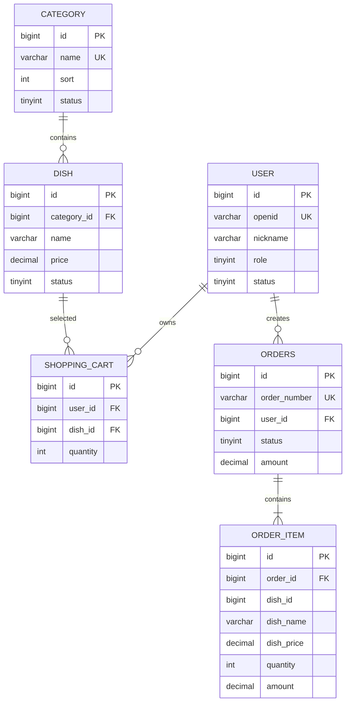

# 小程序点单系统数据库说明文档

## 1. 基本信息

- 数据库名称：`couple_ordering`
- 数据库类型：MySQL 8.x
- 字符集：`utf8mb4`
- 排序规则：`utf8mb4_0900_ai_ci`
- 存储引擎：InnoDB
- 时区：应用层统一使用中国标准时间
- 金额字段：`DECIMAL(10,2)`
- 主键类型：`BIGINT UNSIGNED AUTO_INCREMENT`

第一版数据库包含 6 张核心表：

1. `user`：用户
2. `category`：菜品分类
3. `dish`：菜品
4. `shopping_cart`：购物车
5. `orders`：订单
6. `order_item`：订单明细

收藏、优惠券、库存、支付记录和消息通知暂不纳入第一版。

---

## 2. 数据关系



关系说明：

- 一个分类可以包含多个菜品。
- 一个用户可以拥有多个购物车项。
- 同一用户与同一菜品在购物车中只能有一条记录。
- 一个用户可以创建多个订单。
- 一个订单至少包含一条订单明细。
- 订单明细中的菜品名称、图片和价格是下单时的快照。

---

# 3. 表结构说明

## 3.1 用户表 `user`

用途：保存微信用户身份、角色和启用状态。

| 字段 | 类型 | 约束 | 说明 |
|---|---|---|---|
| id | BIGINT UNSIGNED | PK, AUTO_INCREMENT | 用户主键 |
| openid | VARCHAR(64) | NOT NULL, UNIQUE | 微信小程序用户唯一标识 |
| nickname | VARCHAR(64) | NULL | 用户昵称 |
| avatar_url | VARCHAR(512) | NULL | 用户头像地址 |
| role | TINYINT UNSIGNED | NOT NULL, DEFAULT 0 | 0 普通用户，1 管理员 |
| status | TINYINT UNSIGNED | NOT NULL, DEFAULT 1 | 0 禁用，1 启用 |
| last_login_time | DATETIME | NULL | 最后登录时间 |
| create_time | DATETIME | NOT NULL | 创建时间 |
| update_time | DATETIME | NOT NULL | 修改时间 |

设计说明：

- `openid` 不返回给前端，只在服务端识别用户。
- 当前只给两个人使用，可以通过 `status` 控制白名单。
- 你的账户设置为 `role = 1`，对象的账户设置为 `role = 0`。
- 第一次拿到真实 `openid` 后再插入用户数据，不在初始化 SQL 中写假 `openid`。

---

## 3.2 分类表 `category`

用途：管理菜单分类。

| 字段 | 类型 | 约束 | 说明 |
|---|---|---|---|
| id | BIGINT UNSIGNED | PK, AUTO_INCREMENT | 分类主键 |
| name | VARCHAR(32) | NOT NULL, UNIQUE | 分类名称 |
| sort | INT UNSIGNED | NOT NULL, DEFAULT 0 | 数值越小越靠前 |
| status | TINYINT UNSIGNED | NOT NULL, DEFAULT 1 | 0 禁用，1 启用 |
| create_time | DATETIME | NOT NULL | 创建时间 |
| update_time | DATETIME | NOT NULL | 修改时间 |

设计说明：

- 普通用户接口仅查询 `status = 1` 的分类。
- 分类下仍有菜品时，不允许物理删除分类。
- 菜单展示顺序为 `sort ASC, id ASC`。

---

## 3.3 菜品表 `dish`

用途：保存菜品基础信息。

| 字段 | 类型 | 约束 | 说明 |
|---|---|---|---|
| id | BIGINT UNSIGNED | PK, AUTO_INCREMENT | 菜品主键 |
| category_id | BIGINT UNSIGNED | FK, NOT NULL | 所属分类 |
| name | VARCHAR(64) | NOT NULL | 菜品名称 |
| price | DECIMAL(10,2) | NOT NULL | 当前销售价格，单位元 |
| image_url | VARCHAR(512) | NULL | 菜品图片地址 |
| description | VARCHAR(255) | NULL | 菜品描述 |
| status | TINYINT UNSIGNED | NOT NULL, DEFAULT 0 | 0 下架，1 上架 |
| create_time | DATETIME | NOT NULL | 创建时间 |
| update_time | DATETIME | NOT NULL | 修改时间 |

索引：

- `idx_dish_category_status(category_id, status)`
- `idx_dish_name(name)`

设计说明：

- 新增菜品建议默认下架，确认信息后再上架。
- 普通用户只能查询 `status = 1` 的菜品。
- 价格必须大于等于 0。
- Java 中对应类型使用 `BigDecimal`，禁止使用 `double` 计算金额。
- 菜品历史价格不从该表查询，而是保存在订单明细快照中。

---

## 3.4 购物车表 `shopping_cart`

用途：保存用户尚未提交的点单内容。

| 字段 | 类型 | 约束 | 说明 |
|---|---|---|---|
| id | BIGINT UNSIGNED | PK, AUTO_INCREMENT | 购物车项主键 |
| user_id | BIGINT UNSIGNED | FK, NOT NULL | 所属用户 |
| dish_id | BIGINT UNSIGNED | FK, NOT NULL | 菜品 |
| quantity | INT UNSIGNED | NOT NULL | 数量，必须大于 0 |
| create_time | DATETIME | NOT NULL | 创建时间 |
| update_time | DATETIME | NOT NULL | 修改时间 |

唯一约束：

```text
uk_cart_user_dish(user_id, dish_id)
```

设计说明：

- 同一用户、同一菜品只保存一条记录。
- 重复加入购物车时更新 `quantity`，而不是插入重复记录。
- 查询购物车价格时应读取菜品当前价格。
- 提交订单成功后删除当前用户全部购物车记录。
- 用户只能操作自己的购物车数据。

---

## 3.5 订单表 `orders`

用途：保存订单主体信息。

| 字段 | 类型 | 约束 | 说明 |
|---|---|---|---|
| id | BIGINT UNSIGNED | PK, AUTO_INCREMENT | 订单主键 |
| order_number | VARCHAR(32) | NOT NULL, UNIQUE | 对外展示的订单号 |
| user_id | BIGINT UNSIGNED | FK, NOT NULL | 下单用户 |
| status | TINYINT UNSIGNED | NOT NULL, DEFAULT 1 | 订单状态 |
| amount | DECIMAL(10,2) | NOT NULL | 订单总金额 |
| remark | VARCHAR(255) | NULL | 用户备注 |
| expected_time | DATETIME | NULL | 期望用餐时间 |
| cancel_reason | VARCHAR(255) | NULL | 取消原因 |
| create_time | DATETIME | NOT NULL | 创建时间 |
| update_time | DATETIME | NOT NULL | 修改时间 |

订单状态：

| 值 | 含义 |
|---:|---|
| 1 | 待接单 |
| 2 | 已接单 |
| 3 | 制作中 |
| 4 | 已完成 |
| 5 | 已取消 |

索引：

- `uk_orders_order_number(order_number)`
- `idx_orders_user_time(user_id, create_time)`
- `idx_orders_status_time(status, create_time)`

设计说明：

- 表名使用 `orders`，避免直接使用可能与 SQL 语义冲突的 `order`。
- 订单金额由服务端根据数据库中的菜品价格计算。
- 创建订单、创建订单明细、清空购物车必须处于同一事务中。
- 普通用户只能查询自己的订单。
- 订单号用于展示和查询，数据库关联仍然使用自增主键 `id`。

订单号建议格式：

```text
yyyyMMddHHmmss + 4 位随机数或序列
```

即使生成订单号，也必须依靠唯一索引防止极小概率重复。

---

## 3.6 订单明细表 `order_item`

用途：保存订单中的具体菜品以及下单时快照。

| 字段 | 类型 | 约束 | 说明 |
|---|---|---|---|
| id | BIGINT UNSIGNED | PK, AUTO_INCREMENT | 明细主键 |
| order_id | BIGINT UNSIGNED | FK, NOT NULL | 所属订单 |
| dish_id | BIGINT UNSIGNED | NULL | 下单时的菜品 ID |
| dish_name | VARCHAR(64) | NOT NULL | 下单时菜品名称 |
| dish_image_url | VARCHAR(512) | NULL | 下单时图片地址 |
| dish_price | DECIMAL(10,2) | NOT NULL | 下单时单价 |
| quantity | INT UNSIGNED | NOT NULL | 购买数量 |
| amount | DECIMAL(10,2) | NOT NULL | 明细金额 |
| create_time | DATETIME | NOT NULL | 创建时间 |

设计说明：

- `dish_name`、`dish_image_url`、`dish_price` 必须保存快照。
- 后续修改或删除菜品，历史订单仍然保持原始内容。
- `amount = dish_price × quantity`，由服务端计算。
- `dish_id` 不设置到 `dish` 表的外键，避免菜品生命周期影响历史订单。
- 删除订单时，订单明细通过外键级联删除；正常业务一般不物理删除订单。

---

# 4. 外键策略

| 子表 | 字段 | 父表 | 删除策略 |
|---|---|---|---|
| dish | category_id | category.id | RESTRICT |
| shopping_cart | user_id | user.id | CASCADE |
| shopping_cart | dish_id | dish.id | RESTRICT |
| orders | user_id | user.id | RESTRICT |
| order_item | order_id | orders.id | CASCADE |

说明：

- 分类或菜品被业务数据引用时，不直接删除。
- 删除用户时可以清理购物车，但有历史订单的用户不能删除。
- 订单明细不对 `dish_id` 建外键，以保留历史快照。

---

# 5. 删除与状态策略

第一版采用“状态优先、物理删除受限”的方式：

- 用户：使用 `status` 禁用，不物理删除。
- 分类：优先禁用；没有菜品时才能物理删除。
- 菜品：优先下架；没有购物车引用时才能物理删除。
- 购物车：允许物理删除。
- 订单：不提供普通物理删除功能。
- 订单明细：随订单删除，但正常业务不删除订单。

这样比一开始给所有表增加逻辑删除字段更简单，也能满足两人使用的场景。

---

# 6. 金额计算规则

所有金额计算必须在后端完成：

```text
订单明细金额 = 菜品单价 × 数量
订单总金额 = 所有订单明细金额之和
```

Java 示例：

```java
BigDecimal itemAmount = dishPrice.multiply(BigDecimal.valueOf(quantity));
```

禁止：

```java
double amount = price * quantity;
```

数据库中金额字段统一使用：

```sql
DECIMAL(10, 2)
```

---

# 7. 事务边界

提交订单时必须使用事务，建议在 Service 方法上使用：

```java
@Transactional
```

事务中依次执行：

1. 查询当前用户购物车。
2. 校验购物车不为空。
3. 查询菜品最新状态与价格。
4. 计算金额。
5. 插入订单。
6. 批量插入订单明细。
7. 清空当前用户购物车。
8. 提交事务。

任何一步失败，都应整体回滚。

---

# 8. 第一阶段使用的表

第一阶段只需要读取：

- `category`
- `dish`

第一阶段 SQL 查询目标：

```sql
SELECT id, name, sort
FROM category
WHERE status = 1
ORDER BY sort ASC, id ASC;
```

```sql
SELECT
    d.id,
    d.category_id,
    c.name AS category_name,
    d.name,
    d.price,
    d.image_url,
    d.description,
    d.status
FROM dish d
JOIN category c ON c.id = d.category_id
WHERE d.status = 1
  AND c.status = 1
  AND d.category_id = ?
ORDER BY d.id ASC;
```

---

# 9. 后续可扩展表

第一版跑通后，再按实际需求增加：

| 表 | 用途 |
|---|---|
| user_favorite | 收藏菜品 |
| dish_image | 一个菜品多张图片 |
| operation_log | 管理操作记录 |
| order_status_log | 订单状态变化记录 |
| file_record | 对象存储文件记录 |
| notification | 站内通知或订阅消息记录 |

不要在第一阶段一次性创建所有扩展表。
